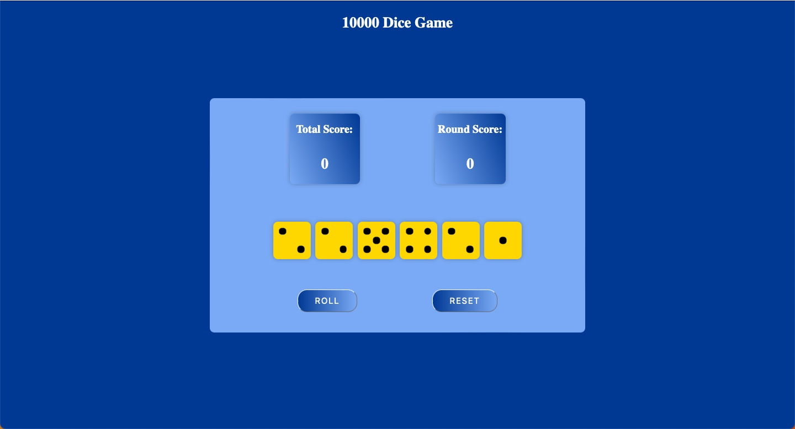
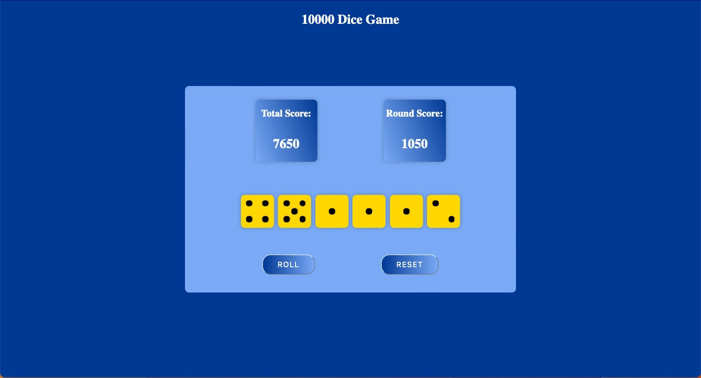
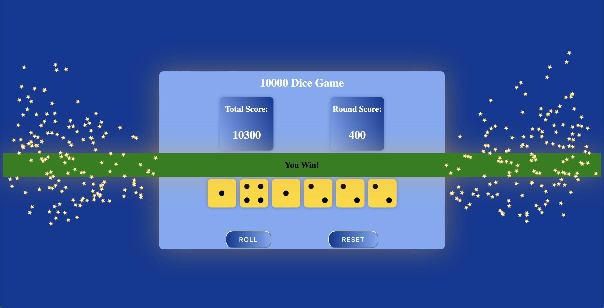

## :game_die: 10000 Dice Game :game_die:

The purpose of this assignment was to create a 10000 Dice Game in HTML/CSS/JavaScript using the tools that we learned throughout the week of lectures. This assigment was pretty cool because I got to use CSS more to style elements on a webpage so it was a fruitful experience to say the least. I also got the chance to add some animation effects which was really cool. I definitely got better understanding of Javascript and creating/using functions throughout the program. I also got more practice using funcions inside of other functions, aswell as Event Listeners. I really enjoyed this project and hope to be able to do more with HTML, CSS, and JavaScript.

